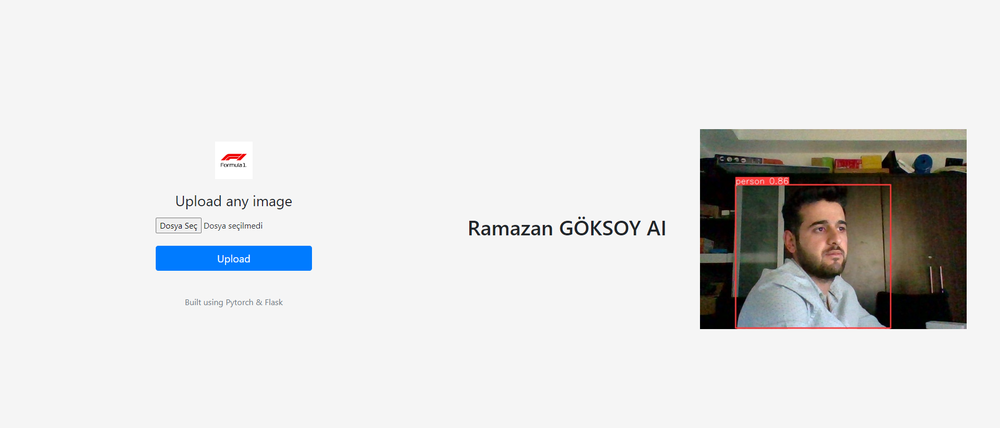

# YoloV5FlaskWebAPI
YoloV5 Flask Web API


Yolov5 Tutorial - [YOLOv5](https://arxiv.org/abs/2207.02696)

Flask Tutorial - [Flask](https://flask.palletsprojects.com/en/2.2.x/)

Download - [YoloV5FlaskAPI](https://github.com/ramazan138/YoloV5FlaskWebAPI.git)


 PyTorch Tutorial : [PyTorch ](https://pytorch.org/)
## Başlamak için Lütfen Okuyun !


<details><summary> <b>Expand</b> </summary>


    
``` shell
Gerekli kütüphaneleri destekleyen bir Nvidia ekran kartına sahipseniz otomatik GPU üzerinde çalışacaktır ,aksi durumunda CPU da yürütülecektir 
app.py dosyasını çalıştırın.


```
    
   


</details>


On Tello Camera:
``` shell
python app.py 
```

### localhost:5000 
### Wep  Camera and İmage  Person detection
<div align="center">
    <a href=".">
        
    </a>
</div>


